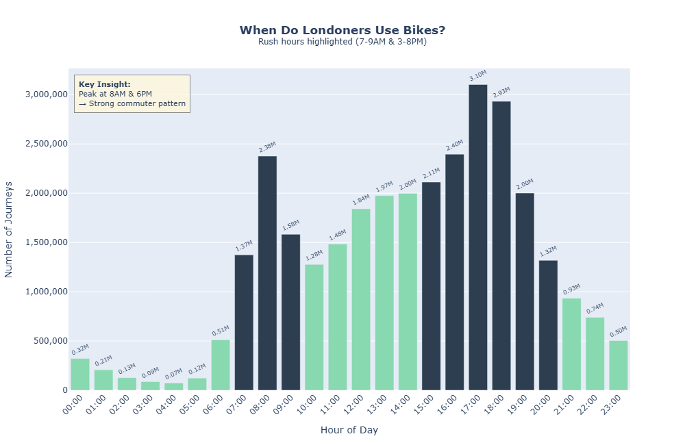
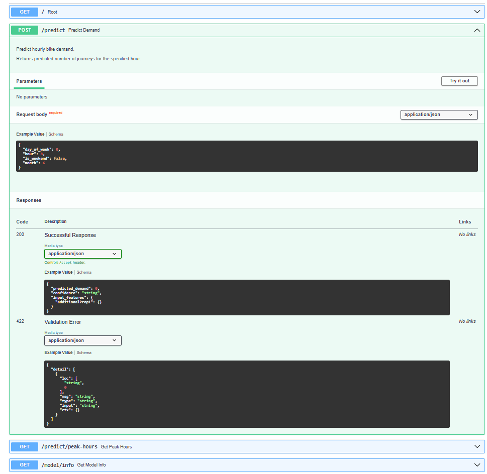
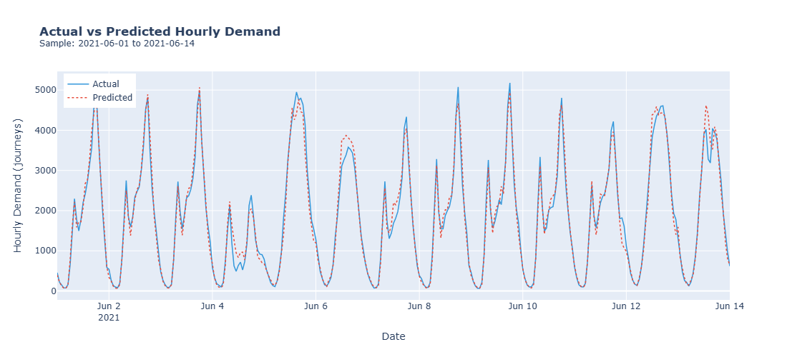
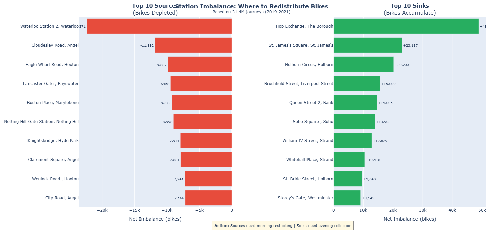

# Urban Mobility Demand Forecasting

City-scale demand forecasting and operational analytics using 31M London bike journeys.

**TLDR**: Analysed 31M TfL journeys → Forecasted hourly demand (R² 0.966) → Identified redistribution windows and pricing strategy for a bike-sharing operator.

## Table of Contents
- [Urban Mobility Demand Forecasting](#urban-mobility-demand-forecasting)
  - [Table of Contents](#table-of-contents)
  - [Key Findings](#key-findings)
  - [Demo](#demo)
    - [Interactive Dashboard](#interactive-dashboard)
    - [REST API](#rest-api)
  - [Overview](#overview)
  - [Technology Stack](#technology-stack)
  - [Project Structure](#project-structure)
  - [Setup](#setup)
  - [Interactive Dashboard](#interactive-dashboard-1)
  - [REST API](#rest-api-1)
    - [Docker Deployment](#docker-deployment)
  - [Analytical Approach](#analytical-approach)
  - [Demand Forecasting Model](#demand-forecasting-model)
  - [Business Recommendations](#business-recommendations)
    - [1. Optimise Bike Redistribution](#1-optimise-bike-redistribution)
    - [2. Customer-Segmented Pricing](#2-customer-segmented-pricing)
  - [Client Recommendations Deck](#client-recommendations-deck)
  - [Experimentation Framework](#experimentation-framework)
  - [Future Enhancements](#future-enhancements)
  - [Reproducibility](#reproducibility)

## Key Findings

| Metric | Value | Business Implication |
|--------|-------|---------------------|
| Unique Bikes | 17,766 | Infrastructure baseline |
| Annual Journeys | ~10M | Market size validation |
| Peak Hours | 8AM, 6PM | Redistribution timing |
| Short Trips (<30min) | 87% | Pricing tier opportunity |
| Day-to-Day Variation | 11% | Consistent demand |
| Post-COVID Growth | +5.5% | Expansion timing validated |



## Demo

### Interactive Dashboard

https://github.com/user-attachments/assets/9eece3d9-ad1a-43c8-a452-f70aed9b4e0e

*Streamlit dashboard with demand forecasting, station analysis maps, and A/B testing framework.*

### REST API



*FastAPI with auto-generated documentation at `/docs`.*

## Overview
This project demonstrates how historical mobility data can support operational and strategic decision-making for a bike-sharing provider.
Using Transport for London Santander Cycles data (2019–2021, ~31M journeys),
the analysis combines behavioural analysis, geospatial insights, and machine
learning to forecast demand and guide fleet management decisions.

## Technology Stack

| Category | Tools |
|----------|-------|
| Core Analysis | Python, pandas, numpy, Jupyter |
| Machine Learning | scikit-learn, XGBoost |
| Visualisation | Plotly, Folium, Streamlit |
| API & Deployment | FastAPI, Docker, uvicorn |
| Data Collection | Selenium, requests |
| Data Engineering | Parquet, categorical typing, ThreadPoolExecutor |

## Project Structure

```
├── app.py                  # FastAPI prediction service
├── dashboard.py            # Streamlit interactive dashboard
├── train_model.py          # Model training script
├── scrape_data.py          # Data collection from TfL API
├── cycling_EDA.ipynb       # Exploratory data analysis & visualisation
├── forecast_model.ipynb    # Time series forecasting models
├── Dockerfile              # Container deployment
├── requirements.txt        # Python dependencies
├── models/                 # Trained model artifacts
├── plots/                  # Static and interactive visualisations
├── data/                   # TfL cycling data (gitignored)
└── reports/Client recommendations.pdf
```

## Setup

```bash
pip install -r requirements.txt
python scrape_data.py          # Downloads ~400MB of data
```

Then open `cycling_EDA.ipynb` for analysis, `forecast_model.ipynb` for modeling.

**Requirements**: Python 3.10+, Chrome browser, ~500MB disk space

## Interactive Dashboard

Launch the Streamlit dashboard for stakeholder-friendly exploration:

```bash
streamlit run dashboard.py
```

The dashboard provides:
- **Demand Prediction** — Select any hour, day, and month to get predicted journeys
- **24-Hour Forecast** — Visualise demand across an entire day with rush hour highlighting
- **Weekday vs Weekend** — Compare commuter and leisure usage patterns
- **Station Analysis** — Interactive maps showing imbalance, popularity, and round-trip hotspots
- **A/B Testing Ideas** — Experiment frameworks for dynamic pricing and operations

## REST API

Start the prediction API for programmatic access:

```bash
uvicorn app:app --reload
```

| Endpoint | Method | Description |
|----------|--------|-------------|
| `/` | GET | Health check |
| `/predict` | POST | Single hour prediction |
| `/predict/day` | GET | 24-hour forecast for a given day |
| `/predict/peak-hours` | GET | Typical peak hour patterns |
| `/model/info` | GET | Model metadata and performance metrics |
| `/docs` | GET | Interactive Swagger documentation |

**Example Request:**
```bash
curl -X POST "http://localhost:8000/predict" \
  -H "Content-Type: application/json" \
  -d '{"hour": 8, "day_of_week": 0, "month": 6, "is_weekend": false}'
```

**Example Response:**
```json
{
  "predicted_demand": 2145,
  "confidence": "medium",
  "input_features": {...}
}
```

### Docker Deployment

```bash
docker build -t bike-demand-api .
docker run -p 8000:8000 bike-demand-api
```

## Analytical Approach

The dataset contains over 30 million journeys, so the analysis was structured to progress from behavioural understanding to operational decision support:

1. **Behaviour Characterisation** — Separated predictable commuter demand from irregular leisure demand using temporal and spatial patterns

2. **Operational Alignment** — Aggregated data at hourly resolution to match real operational decisions (staffing, fleet positioning, maintenance)

3. **Forecasting Formulation** — Treated demand prediction as supervised regression with cyclical time encoding, lag features, and rolling averages

4. **Decision Integration** — Translated model outputs into actionable recommendations rather than standalone predictive metrics

## Demand Forecasting Model

**Objective**: Predict hourly system-wide demand

Data was aggregated from 31M journeys into ~26K hourly observations. Time-aware splitting (train: 2019–2020, test: 2021) prevented leakage.

**Features**: Cyclical time encoding • Lag features (1h, 24h, 168h) • Rolling means (24h, 7-day)

| Model | Test MAE | Test R² | Test RMSE |
|-------|----------|---------|-----------|
| **XGBoost** | **199.7** | **0.966** | **285.3** |
| Random Forest | 205.1 | 0.963 | 298.7 |
| Gradient Boosting | 208.4 | 0.961 | 306.2 |

**Validation**: No data leakage (`.shift()` for lags) • Time-based split • Feature importance analysis • Visual inspection of predictions vs actuals.



## Business Recommendations

### 1. Optimise Bike Redistribution
Combine station imbalance data with demand forecasting:
- Pre-position bikes at source stations before 7AM rush
- Deploy collection crews at sink stations overnight (10PM-6AM)
- Prioritise top 10 imbalanced stations (80% of redistribution need)



### 2. Customer-Segmented Pricing
Two products for two distinct user types:
- **Commuter Pass**: Flat monthly fee, unlimited 30-min rides (87% qualify)
- **Leisure Premium**: Higher per-ride pricing for round-trips/park stations
- **Dynamic Surge**: Peak-hour pricing (6-8PM weekdays)

## Client Recommendations Deck
A concise presentation is included to communicate findings and
recommendations to non-technical stakeholders.

**[View Slide Deck](Client%20recommendations.pdf)**

The deck includes:
- Key usage patterns and customer segments
- Visual demand forecasts
- Operational and pricing recommendations

## Experimentation Framework

The forecasting model enables data-driven experiments for operational optimisation:

| Experiment | Hypothesis | Metrics |
|------------|------------|---------|
| **Dynamic Pricing** | Surge pricing during peak hours reduces demand spikes by 15% | Peak-to-average ratio, revenue per journey |
| **Redistribution Alerts** | Proactive bike repositioning reduces empty stations by 30% | Station availability, user complaints |
| **Commuter Subscriptions** | Flat monthly pass increases weekday retention by 20% | MAU, journey frequency |
| **Weekend Promotions** | 10% discount increases weekend utilisation by 25% | Weekend journeys, new user acquisition |

**Implementation approach**: Station-level randomisation into control/treatment groups, 4-6 week experiment duration, significance testing at α=0.05.

## Future Enhancements

| Category | Enhancement | Status |
|----------|-------------|--------|
| **Deployment** | REST API with FastAPI | Complete |
| **Deployment** | Interactive Streamlit dashboard | Complete |
| **Deployment** | Docker containerisation | Complete |
| **MLOps** | Model performance monitoring endpoint | Complete |
| Model | Weather API integration | Planned |
| Model | Station-level forecasting | Planned |
| Analytics | K-means customer segmentation | Planned |

## Reproducibility

The dataset is publicly available from TfL.
Notebooks can be executed independently after installing dependencies.
Large raw files are excluded from the repository for size reasons.

---
**Author**: Nitya Devaraj  
**Dataset**: [Transport for London Cycling Data](https://cycling.data.tfl.gov.uk/) (2019-2021)